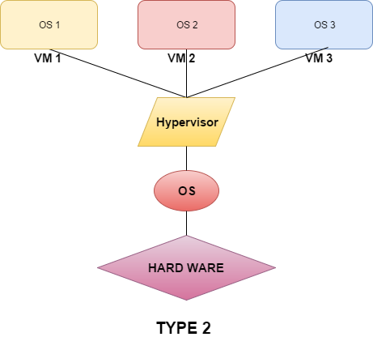

# Understanding Linux Virtualization
## What is virtualization?
Là môi trường phần cứng không có thật. Tại đây, sao chép chức năng của phần cứng vật lý và đưa vào HĐH.  
## Advantages of virtualization
- Quản lý tập trung, dễ vận hành  
- Khai thác tối đa tài nguyên  
- Cung cấp máy chủ nhanh hơn  
- Cân bằng tải tự động: Cung cấp khả năng các VM đang sử dụng quá mức tài nguyên được di chuyển (live migration) đến các máy chủ chưa sử dụng.  
- Dễ dàng nâng cấp, mở rộng hệ thống  
- Tính sẵn sàng cao...  

## Operating System Virtualization
Cho phép một máy chủ vật lý phục vụ nhiều service khác nhau và cô lập mỗi service. Mỗi service sẽ hoạt động độc lập trên cùng một OS.  
Vì chạy trên cùng một OS nên những VM không cần phải cài đầy đủ OS nữa mà chỉ cần có những file cần thiết giúp tăng hiệu năng nhưng nhược điểm là tất cả các VM phải chạy trên cùng 1 OS.  
### Full Virtualization
Hypervisor cung cấp sự ảo hóa hoàn toàn, các guest OS không biết về hypervisor. Mỗi VM hoạt động như nó đang chạy một mình trên phần cứng độc lập.  
### Para Virtualization
Là kỹ thuật ảo hóa được hỗ trợ và điều khiển bởi 1 hypervisor nhưng các guest OS thực thi các lệnh không thông qua hypervisor. Trong Para Virtualization, các guest OS biết được rằng nó được ảo hóa để tận dụng chức năng. 
## Hardware assisted virtualization
Bộ vi xử lý hỗ trợ được tối ưu hóa hơn để quản lý môi trường ảo. Là phương pháp ảo hóa được thiết kế để sử dụng hiệu quả Full Virtualization. 
## Hypervisor/VMM
Là 1 phần của phần mềm chịu trách nhiệm giám sát và kiểm soát VM, phân bổ các tài nguyên theo yêu cầu. 
### Hypervisor Type 1 - Bare metal
Là loại hypervisor chạy trực tiếp trên phần cứng của máy chủ, không thông qua OS nào cả.  
  
### Hypervisor Type 2 - Host Based
Là loại hypervisor được cài đặt và hoạt động như một phần mềm thông thường. Sử dụng các dịch vụ được HĐH cung cấp để phân chia tài nguyên tới các máy ảo.  
  

## Introducing KVM
Kernel-based virtual machine (KVM) là giải pháp Full Virtualization cho Linux trên phần cứng x86, nó bao gồm module hạt nhân có thể tải được. Nó mô phỏng CPU, RAM, network,... để xây dựng một bộ phần cứng ảo hoàn chỉnh.

