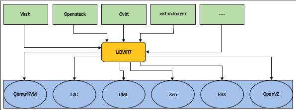

# KVM Internals
## libvirt
Là lớp quản lý bổ sung có thể giao tiếp với các hypervisor khác nhau. Giao diện dòng lệnh của libvirt là virsh.  
  
libvirtd là daemon của libvirt. Khi virsh hoặc virt-manager,... yêu cầu một dịch vụ từ libvirtd, dựa trên URI kết nối được truyền bởi client, libvirtd mở một kết nối đến hypervisor. 
## QEMU
Quick Emulator được sử dụng làm máy mô phỏng, QEMU có thể chạy nhiều OS và Program ở một máy trên một máy khác.  
- Qemu as an Emulator: Qemu có khả năng chạy các OS, Program được thực hiện cho một máy trên một máy khác do sử dụng các phương pháp dịch nhị phân. Trong chế độ này, QUEMU mô phỏng CPU thông qua kỹ thuật dịch nhị phân động và cung cấp một bộ các mô hình thiết bị.  
- Qemu as an Virtualization: Là chế độ QEMU thực thi guest code trực tên trên host CPU, do đó đạt được hiệu suất cao.  

## KVM
KVM là module nằm trong kernel có thể tạo ra không gian cho các ứng dụng.  
KVM có kernel module gọi là kvm.ko, kvm-intel.ko, kvm-amd.ko. KVM sẽ nạp module tương ứng với phần cứng để biến kernel Linux thành một hypervisor, do đó đạt được sự ảo hóa.  
KVM có tệp thiết bịtrong /dev/kvm, QEMU sử dụng tập tin thiết bị này để giao tiếp với KVM và tạo, quản lý chế độ kernel của các VM.  
KVM không phải là một hypervisor đầy đủ, tuy nhiên với QEMU và các emulator (bộ mô phỏng) thì nó mới trở thành 1 hypervisor đầy đủ.  
### KVM APIs
KVM API là một ioctls được phát hành để kiểm soast các khía cạnh khác nhau cảu một máy ảo. Có 3 loại ioctls:  
- System ioctls: Truy vấn và set thuộc tính global, nó ảnh hưởng đến toàn bộ hệ thống con KVM. Ngoài ra, system ioctl còn được sử dụng để tạo các VM.  
- VM ioctls: Truy vấn và set thuộc tính ảnh hưởng đến VM. Ngoài ra, VM ioctl còn được sử dụng để tạo các CPU ảo.  
- vCPU ioctls: Truy vấn và set các thuộc tính kiểm soát hoạt động của một vCPU. 
