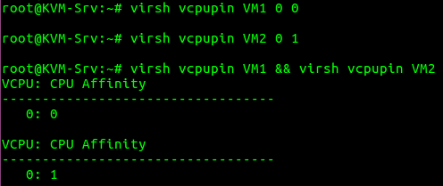
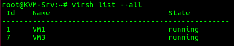

# Mô hình lab
  
Có 2 Host, 1 Host chạy Ubuntu Server 16.04, 1 Host chạy Ubuntu Desktop 16.04 và 1 Server NFS dùng làm share storage. Trên Host Ubuntu Server tạo các VM bằng cách sử dụng lệnh virsh, trên Host Ubuntu Desktop tạo VM bằng virt-manager. Yêu cầu:  
- Limit CPU  
- Limit Bandwidth  
- Add & Remove Disk  
- Add & Remove NIC  
- Offline Migrate VM2 -> Host Ubuntu Desktop  
- Live Migrate VM3 -> Host Ubuntu Server  

# Cấu hình
Cài đặt kvm trên cả 2 Host
```
apt-get install qemu-kvm libvirt-bin virtinst
```
## Cấu Hình NFS
### NFS Server
Cài NFS 
```
apt-get install nfs-kernel-server
```
Tạo share directory
```
mkdir -p /var/lib/libvirt/images/
chown nobody:nogroup /var/lib/libvirt/images/
```
Thiết lập NFS chia sẻ thư mục trong file `/etc/exports/`  
```
/var/lib/libvirt/images/ 192.168.66.191(rw,sync,no_root_squash,no_subtree_check)
/var/lib/libvirt/images/ 192.168.66.204(rw,sync,no_root_squash,no_subtree_check)
```
Restart NFS
```
systemctl restart nfs-kernel-server
```
### NFS Client
Trên 2 Host cài đặt
```
apt-get install nfs-common
```
Mount thư mục share
```
mount 192.168.66.214:/var/lib/libvirt/images /var/lib/libvirt/images
```
Vào file `/etc/libvirt/qemu.conf` và uncomment 2 dòng sau
```
user = "root"
group = "root"
```
Để tự động mount thư mục khi reboot vào file `/etc/fstab` và thêm
```
192.168.66.214:/var/lib/libvirt/images /var/lib/libvirt/images nfs auto,nofail,noatime,nolock,intr,tcp,actimeo=1800 0 0
```

## Cài đặt Network cho Host
Trên các Host cần cài đặt chung 1 loại network. Ở đây có 2 cách sử dụng OpenvSwitch hoặc Linux Bridge.
### Cài đặt & Cấu hình OpenvSwitch
Đầu tiên xóa default network để tránh xung đột
```
virsh net-destroy default
virsh net-autostart --disable default
```
Cài đặt OVS
```
apt-get install openvswitch-switch
```
Enable IPv4 forwarding
```
echo 1 > /proc/sys/net/ipv4/ip_forward
```
hoặc xóa comment dòng `net.ipv4.ip_forward=1` trong file `/etc/sysctl.conf` để lưu vĩnh viễn  
Tạo bridge và up br0
```
ovs-vsctl add-br br0
ip link set br0 up
```
Add ens33 vào bridge
```
ovs-vsctl add-port br0 ens33
```
Cấu hình network trong file `/etc/network/interfaces`  
```
auto ens33
iface ens33 inet manual
up ifconfig ens33 0.0.0.0 up
up ip link set ens33 promisc on
down ip link set ens33 promisc off
down ifconfig ens33 down

auto br0
iface br0 inet dhcp
```
Down Và Up lại tất cả card mạng
```
ifdown --force -a && sudo ifup --force -a
```
Kiểm tra lại card mạng.  
  
Ta thấy br0 đã nhận được IP của card ens33, thử ping ra ngoài Internet  
  

### Cài đặt và cấu hình Linux Bridge
Tạo br1 bằng linux bridge  
```
brctl addbr br1
```
Add card ens33 vào br1
```
brctl addif br1 ens33
```
Cấu hình bridge trong file `/etc/network/interfaces`  
```
auto ens33
iface ens33 inet manual
up ifconfig ens33 0.0.0.0 up
up ip link set ens33 promisc on
down ip link set ens33 promisc off
down ifconfig ens33 down

auto br1
iface br1 inet dhcp
bridge_ports ens33
bridge_stp off
bridge_fd 0
bridge_maxwait 0
```
Restart lại toàn bộ card mạng
```
ifdown --force -a && sudo ifup --force -a
```

## Tạo VM
### Tạo VM bằng virsh command sử dụng OVS
Dùng lệnh virsh để tạo VM từ image có sẵn.
```
virt-install -n VM1 -r 512 --vcpus 1 --os-type linux --os-variant ubuntu16.04 --network bridge=br0,virtualport_type='openvswitch' --hvm --virt-type kvm --disk path=/var/lib/libvirt/images/VM1.qcow2 --graphics vnc,listen=0.0.0.0 --noautoconsole --import
```
Giải thích các option
```
-n VM1: tên VM
-r 512: RAM VM
--vcpus 1: Số CPU ảo cho VM
--os-type linux: chỉ định loại OS
--os-variant ubuntu16.04: giúp tối ưu hóa guest config cho 1 OS cụ thể
--network
  bridge=br0: kết nối với br0 (bridge được tạo bằng ovs)
  virtualport_type='openvswitch':bridge dạng ovs
--hvm --virt-type kvm:
--disk
  path=/var/lib/libvirt/images/VM1.img: đường dẫn tới image
--graphics vnc,listen=0.0.0.0: xuất bảng điều khiển ảo trên tất cả interface
--noautoconsole: không tự động kết nối với console của VM
--import: import image 
```
Console vào VM và cài đặt như OS bình thường
```
virsh console VM1
```

### Tạo VM bằng virt-manager
Cài đặt virt-manager
```
apt-get install virt-manager
```
Sau khi cài đặt cần log out rồi log in lại để user nhận được quyền.  
Chạy virt manager chọn **File** --> **New Virtual Machine**.  Nếu đã có image sử dụng tùy chọn **Import existing disk image**
  
Chọn đường dẫn tới img  
  
Tùy chọn RAM và CPU cho VM  
  
Đặt tên cho VM và tại mục **Network selection** chọn network br1 đã tạo ở trên rồi finish hoặc có thể chọn **Customize configuration before install** để tùy chỉnh lại cấu hình trước khi cài đặt.  
  
**Lưu ý:** Có thể dùng virt-manager để truy cập vào VM1 hoặc sử dùng câu lệnh `virsh console VM3`  

## Kiểm tra
Trên cả 3VM đã nhận được IP  
  
  
  
Các VM có thể ping đến nhau và ra Internet  
  

# Làm việc với VM
## Add, Remove NIC
### Add NIC Linux Bridge
Có 2 cách:  
**Cách 1:** Dùng câu lệnh
```
virsh attach-interface --domain VM3 --source br1 --type bridge --model virtio --live --config --persistent
```
Giải thích option
```
--domain: tên VM
--source: tên bridge
--type bridge: chỉ định loại network
--live: Add NIC khi Server đang chạy
--config: Giữ cấu hình interface khi khởi động lại VM
```
Sau khi add interface thành công. Show list interface để kiểm tra.  
  
**Cách 2:** Sửa VM trong file xml  
Trước khi edit VM cần shutdown VM bằng lệnh
```
virsh shutdown VM3 
hoặc
virsh destroy VM3
```
Dùng lệnh sau để edit VM
```
virsh edit VM3
```
Thêm đoạn cấu hình interface sau vào trong thẻ **domain**  
```
<interface type='bridge'>
  <source bridge='br1'/>
  <model type='virtio'/>
</interface>
```
Khởi động lại VM
```
virsh start VM3
```

### Add NIC OpenvSwitch
Đối với OpenvSwitch chỉ có thể thêm interface bằng cách sửa file xml của VM.  
Đầu tiên shutdown VM và thêm đoạn cấu hình interface sau vào trong thẻ **domain**  
```
<interface type='bridge'>
 <source bridge='br0'/>
 <virtualport type='openvswitch'/>
 <model type='virtio'/>
</interface>
```
Kiểm tra list interface  
  

### Remove NIC
**Cách 1:** Sử dụng lệnh để remove NIC  
Đầu tiên cần dùng lệnh sau để lấy MAC của interface  
```
virsh domiflist VM2
```
Sau đó remove NIC bằng lệnh
```
virsh detach-interface --domain VM2 --type bridge --mac 52:54:00:49:78:04 --live --config --persistent
```

**Cách 2:** Sửa file cấu hình VM  
Đầu tiên cũng cần tìm kiếm MAC của interface bằng lệnh
```
virsh domiflist VM2
```
Shutdown VM
```
virsh shutdown VM2
```
Edit VM
```
virsh edit VM2
```
Tìm đến thẻ interface và đúng MAC của interface để xóa.  

## Add, Remove Disk
### Add Disk
Có 2 loại disk  
- Preallocated: Loại disk này sẽ gán toàn bộ không gian ổ đĩa ngay khi tạo, nó có tốc độ ghi nhanh.  
- Thin-Provisioned: Loại disk này không gian sẽ chỉ được phân bổ khi cần, nó giúp tiết kiệm không gian đĩa.  

Tạo disk image Preallocated
```
qemu-img create -f raw congnt.ing 1G
hoặc
dd if=/dev/zero of=congnt.img bs=1G count=1
```
Tạo disk image Thin 
```
dd if=/dev/zero of=congnt_seek.img bs=1G seek=10 count=0
```
Sau khi tạo xong có thể xem thông tin img  
  
Attach Disk bằng lệnh
```
virsh attach-disk VM2 --source /var/lib/libvirt/images/congnt.img --target vdb --persistent --config --live
```
Sau đó có thể sử dụng disk trong VM.  

### Remove Disk
Remove Disk bằng lệnh
```
virsh detach-disk VM2  /var/lib/libvirt/images/congnt.img --persistent --config --live
```
Kiểm tra Disk có trong VM
```
virsh domblklist VM2
```

## CPU Pin
Chỉ định CPU của VM sẽ được xử lý bởi CPU nào của máy vật lý
### Show CPU Pin
```
virsh vcpupin VM1
```
### Edit CPU Pin
```
virsh vcpupin VM1 vCPU pCPU
```
VD: Trên máy host có 2 CPU và có 2 VM mỗi VM 1 vCPU. Ta sẽ chỉ định VM1 sử dụng CPU 0 của host và VM2 sử dụng CPU 1 của host.  
```
virsh vcpupin VM1 0 0
virsh vcpupin VM2 0 1
```
  

## Limit CPU, Bandwidth
### Limit Bandwidth
Shutdown VM
```
virsh shutdown VM2
```
Sửa cấu hình VM
```
virsh edit VM2
```
Thêm cấu hình sau đây vào thẻ interface của cổng muốn limit (KB/s)
```
<bandwidth>
 <inbound average='12000'/>
 <outbound average='12000'/>
</bandwidth>
```
### Limit CPU
Limit CPU bằng lệnh sau
```
virsh schedinfo VM1 [--live] [--config] [--current] --set vcpu_quota=[1000, 18446744073709551]
--live: áp dụng với VM đang running
--config: áp dụng với VM kể cả khi reboot
--current: áp dụng với VM chỉ 1 lần
```

## Migrate
### Offline Migrate 
Migrate VM2 --> Host Ubuntu Desktop  
```
virsh migrate --offline --verbose --persistent --undefinesource VM2 qemu+ssh://192.168.66.191/system
```
Khi migrate xảy ra lỗi
```
error: Unsafe migration: Migration may lead to data corruption if disks use cache != none
```
Shutdown VM2, thêm `cache='none'` như sau
```
<disk type='file' device='disk'>
 <driver name='qemu' type='qcow2' cache='none'/>
 <source file='/var/lib/libvirt/images/VM2.qcow2'/>
 <target dev='vda' bus='virtio'/>
 <address type='pci' domain='0x0000' bus='0x00' slot='0x04' function='0x0'/>
</disk>
```
Thực hiện migrate lại  
  
VM2 đã được migrate và undefine khỏi Host KVM-Srv. Kiểm tra trên Host KVM-Desktop ta thấy VM2 đã được chuyển sang  
  
Bây giờ có thể start VM trên Host mới bình thường.  

### Live Migrate
Các Host cần phải biết host name của nhau, chỉnh sửa file `/etc/hosts`
```
192.168.66.194	KVM-Desktop
192.168.66.204	KVM-Srv
```
Live Migrate VM3 --> Host Ubuntu Server
```
virsh migrate --live --verbose --undefinesource VM3 qemu+ssh://192.168.66.204/system
```
  
VM3 đã được migrate sang Host KVM-Srv. Kiểm tra ta thấy VM3 khi chuyển sang vẫn đang chạy.  
  

**Note:** Nếu VM không chạy trên share storage sử dụng option `--copy-storage-all`  

## Các lệnh show cấu hình
List VM  
```
virsh list [option]
```
List Interface VM
```
virsh domiflist VM
```
List volume
```
virsh domblklíst VM
```
List info VM
```
virsh dominfo VM
```
Thông tin Host
```
virsh nodeinfo 
```
Save & Restore VM  
VM có thể được lưu và khôi phục lại nhiều lần bằng cách save & restore  
```
virsh save VM1 /var/lib/libvirt/images/VM1-Save
virsh restore /var/lib/libvirt/images/VM1-Save
```
